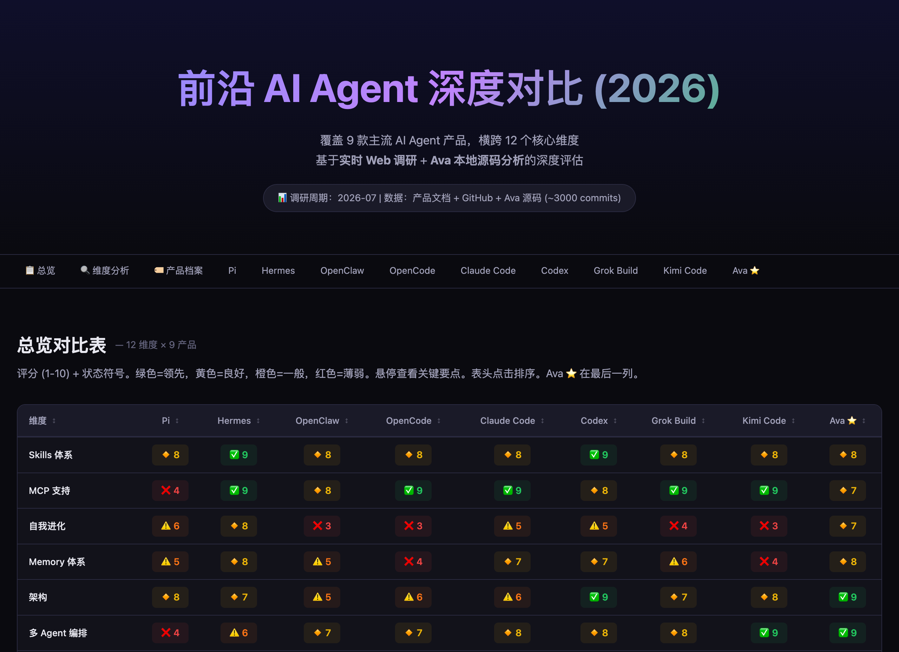

# Case Study — Frontier-Agent Landscape Research (a real run)

**What this shows**: the checkpoint completion protocol at real scale — an
18-agent, 3-wave research workflow where the orchestrator was woken **6 times
total**, including a live timeout-recovery path. This is a transcript-derived
case study of an actual production run, not a synthetic benchmark.

## Prompt

The user asked (paraphrased from the original, which was in Chinese):

> Produce a deep comparison of nine frontier coding/agent products for our
> open-source landing page. Align on method with me first. Budget: at most 30
> agents. Use the pro tier for judgment work and the flash tier for mechanical
> work. Deliver an HTML report I can open, then wait for my review.

No workflow structure was prescribed. The agent chose the wave decomposition,
the checkpoint placement, and the model tiering itself.

## Expected flow

What the agent actually did:

1. **Align** — posted a method proposal (dimensions, sources, wave plan) and
   idled until the user replied. Zero agents spent before alignment.
2. **Wave 1 — research** (9 workers): one worker per product, each researching
   live sources and writing a result file to a shared handoff directory, then
   terminating silently.
3. **Wave 2 — synthesis + verification** (7 workers): cross-product synthesis
   and adversarial fact-checking over wave-1 files. One wave-1 straggler was
   retried here (the 18th agent).
4. **Wave 3 — HTML** (1 worker): rendered the final page and served it.
5. **Deliver and hold** — posted the link, then idled waiting for the user, as
   instructed.

## Expected output

A served HTML report (9 products × 12 dimensions, colour-coded matrix plus
per-product dossiers), delivered in ~50 minutes end to end.

## The numbers

| Metric | Value |
|---|---|
| Agents used | 18 of a 30-agent budget (17 workers + 1 retry) |
| Waves | 3 (research → synthesis → HTML) |
| Wall-clock | ~50 minutes |
| **Orchestration wake-ups** | **6** — 4 watcher firings + 2 checkpoint markers |
| Worker completion messages to the orchestrator | 0 |

The wake-up ledger, from the run's actual inbound messages:

| # | Wake-up | What happened |
|---|---|---|
| 1 | `gather-w1-research` watcher, exit 124 | Wave-1 gather hit its timeout with stragglers still running — orchestrator woke, assessed, re-armed |
| 2 | `gather-w1-openclaw` watcher, exit 124 | Second timeout on the same wave — orchestrator retried the straggler as a fresh worker |
| 3–4 | Wave-2 checkpoint marker + `gather-w2-synthesis` watcher, exit 0 | Synthesis wave complete, all files present |
| 5–6 | Wave-3 checkpoint marker + `gather-w3-html` watcher, exit 0 | Final page rendered and served |

Two details worth noticing:

- **The timeout path is real.** Two of the six wake-ups were `exit 124`
  timeouts, not clean completions. The orchestrator recovered both times —
  once by extending the window, once by respawning the straggler. A protocol
  demo that only shows the happy path proves little; this run exercised the
  failure arm.
- **Zero per-worker completion messages.** Under a naive protocol, 17 workers
  reporting individually would have produced at least 17 orchestrator LLM
  turns just to say "done". Here every worker wrote its result file and
  terminated silently; the four gather watchers each reported a whole batch in
  one message.

## Why this matters

The orchestrator here is not a workflow definition submitted to an engine — it
is Python the agent wrote in its own `execute_code` turns. The wave loop, the
K-of-N gather, the timeout handling, the straggler retry: all plain control
flow (`for`, `if`, a watcher arm, a respawn call). When wave 1 timed out, no
DSL had to have anticipated a "retry straggler" node — the agent just wrote
the retry.

That is the general trade this repo bets on: orchestration runtimes that
expose a constrained workflow vocabulary make the common shapes cheap but the
uncommon ones impossible without an escape hatch; code-as-action makes every
shape the same price — a few lines of Python. The checkpoint protocol
(`skills/ava-dynamic-workflow/`) is deliberately small because the language
underneath it is already the full one.

One honesty note: this case study demonstrates *orchestration mechanics* —
wake-up economics, failure recovery, budget discipline. The *content quality*
of the resulting report depends mostly on the underlying models, which is why
we publish no head-to-head output-quality comparisons here.

The report this run produced, served by the agent's own `ava.ui` at delivery
time (in Chinese — the language the operator asked in):

