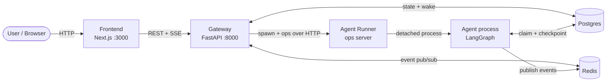

# Ava

**A CodeAct, self-evolving multi-agent system.**


Ava agents act by **writing code**, not by picking from a menu of tools. They
form a **fleet** — a graph of peers that spawn, fork, and message one another —
and they can **read and modify their own source**, shipping changes through
PR → CI → merge and then rolling the new code across the running cluster with
`ava cluster update`.

The core is deliberately small. From day one every layer is built asking *can
this scaffolding be stripped once the model is strong enough to not need it?* —
so the stronger the model gets, the less of Ava there is. (The design thread is
in [`conventions/philosophy.md`](../conventions/philosophy.md).)

---

## 🚀 Quickstart

From zero to your first agent in about 15 minutes — full install guide with
screenshots, Windows notes, and FAQ: **[QUICKSTART.md](../QUICKSTART.md)**.

---

## Why Ava

### 1. Self-Evolving — the cluster upgrades itself

Ava's cluster upgrades itself. New code lands on `main`, and `ava cluster update`
rolls the whole cluster onto it — without stopping the work in flight. An
agent's current code execution finishes at its turn boundary before the new
version takes over; only wedged processes are force-reaped. The rollout is
self-supervised: a canary runs the new code under observation while a holdout
on the old code watches, and rolls back on regression. No maintenance windows,
no babysitting — the cluster works by day and updates itself by night.

→ [How self-evolution works](features/self-evolving.md)

### 2. CodeAct — one tool, the whole Python namespace

Agents act by writing Python. One `execute_code` tool plus the whole `ava.*`
namespace is every capability — files, network, search, memory, even spawning
other agents. No multi-tool dispatch, no per-capability JSON schema; the agent
orchestrates with real control flow. A `for`-loop can spawn and coordinate an
entire fleet:

```python
for product in products:
    ava.agents.spawn(
        prompt=f"Research {product} from live sources; "
               f"write findings to out/{product}.md",
        label=f"research-{product}",
    )
ava.watcher.launch(gather_wave_1, timeout="30m", name="gather-w1")
```

In a real production run, an agent decomposed a nine-product competitive
research goal into three waves of 18 workers by itself — wave split,
checkpoint placement, and model tiering were all its own choices — and the
orchestrator was woken only six times.

→ [How CodeAct works](features/code-act.md)

### 3. Fleet — a graph of peers, not a chain

Multi-agent is native: any agent can `spawn` a peer, `fork` another agent's
explored context, and `send_message` it directly — all peers, no central
scheduler. Ties form on spawn/fork/message and fade with time;
`get_neighbors` ranks who to talk to by tie strength, and `get_ancestors`
walks the spawn chain above an agent for responsibility attribution. Recovery
is decentralized too: a watcher wakes a supervisor the moment a worker stalls,
and a terminated agent auto-resurrects to handle an incoming message.

```python
worker = ava.agents.spawn(
    prompt="Refactor the auth module; tests must stay green.",
    fork_from=ava.self.AGENT_ID,   # inherit context — the edge is the dependency graph
    label="auth-refactor",
)
ava.agents.send_message(worker, "Skip the legacy SAML path — out of scope.")
```

The human side is first-class as well: every agent's notifications — progress,
FYIs, decisions that need your call — converge into **one aggregated
notification queue**, and agents organize across conversations through a
**shared persistent task graph** (parent/child trees, owners, reminders).

→ [How the fleet works](features/fleet.md)

### 4. Anti-RL-Bias — first-class verbs for intent

RLHF-tuned models carry two habits that hurt a long-lived agent: treating a
text turn as "I answered, therefore I'm done", and going quiet when unsure.
Ava answers both from the system layer: explicit verbs declare intent
(`pause_heartbeat` says "I am deliberately waiting"), a heartbeat daemon
offers idle agents three honest options (working / waiting / done), and
mechanisms nudge agents that stall, reach for the wrong SDK idiom, or miss a
newly installed skill. Ambiguous silence becomes supervisable state.

→ [All anti-RL-bias mechanisms](features/anti-rl-bias.md)

### 5. Observability — every turn is a trace

Each agent turn records an OTel trace — standard OpenTelemetry format, LLM
content stripped at the source. One command starts a read-only Tempo + Loki +
Prometheus + Grafana stack where traces, logs, and metrics share a single UI.
Underneath, every signal is one unified event stream carrying a trace_id, so
logs and traces correlate; alerts reach chat end to end.

→ [How observability works](features/observability.md)

### 6. Multi-Machine — a single box is the N=1 case

Multi-machine is the default, not a premium configuration. A cluster is one
gateway machine (owns the data plane) plus any number of agent-runner machines
(only execute agents); **any machines that are network-reachable to each other
form a cluster**. Authentication is always on and fail-closed. macOS, Linux,
and Windows are all supported — Windows joins natively as an agent-runner, no
WSL, no Docker. A single box is just the N=1 case: no flag, no opt-in.

→ [How multi-machine deployment works](features/multi-machine.md)

### 7. Plugins — typed extension points in the runtime

Plugins insert custom behavior into the agent execution graph at five
injection points (after init, before the LLM call, before/after code
execution, at context setup). A plugin registers a whole typed pydantic state
model that becomes a private channel in the agent's state graph — typed
read/write handles, fail-fast on conflicts, persisted with the framework
checkpoint. Write a `plugin.py`, drop it in a directory, done.

→ [How plugins work](features/plugins.md)

### 8. Skills — the open Agent Skills standard, zero rewrite

Ava reads the open Agent Skills standard (SKILL.md) — the format Claude Code
popularized, now shared by Codex, Cursor, and Gemini CLI. Any standard skill
folder installs unmodified: from a git URL or straight off disk, no manifest,
no conversion. A hundred installed skills cost a hundred description lines in
the prompt, not a hundred bodies — full text loads on demand.

→ [How skills work](features/skills.md)

### 9. Memory — a shared pool that outlives any conversation

Ava agents share a memory pool that outlives any conversation: markdown notes
plus semantic search, visible to every agent. Long tasks are handed off
through notes, not conversation context — restart, compaction, or a new agent
taking over loses nothing. A steward agent consolidates, health-checks, and
commits the pool daily; the index is injected at cold start and after each
compaction, so standing rules stay in front of the agent.

→ [How memory works](features/memory.md)

---

## Where Ava sits in the landscape

A quick comparison against other open agent frameworks (full
ten-product × fifteen-dimension matrix with per-cell evidence:
[`assets/agent-landscape-2026.html`](../assets/agent-landscape-2026.html)):

| Dimension | Ava | OpenCode | Hermes Agent | OpenClaw | DeepSeek Harness |
|---|---|---|---|---|---|
| CodeAct / code-as-action | ✅ the whole runtime is one `execute_code` channel, from day one | ❌ no Code Mode (build/plan agents); tool results flatten to text | ❌ standard tool-calling | ❌ standard tool-calling | ⚠️ Code Mode (2026-08): a TS program over generated tool bindings — one mode on top of standard tool-calling |
| Typed model-visible extension | ✅ `register_plugin_state`: whole pydantic models become state-graph channels; can contribute messages directly | ❌ no message-schema extension; listen + compaction text injection only | ❌ extension at tool/skill/transport layer | ❌ no schema API; runtime middleware rewrite only | ✅ `SessionEventMap` event-sourcing: new event type + render + replay ("model-visible means logged") |
| Observability | ✅ OTel + Tempo/Loki/Prometheus/Grafana; every turn is a trace; logs/traces correlate via trace_id | — | — | — | ✅ conversation-level event-sourced log with dispatch-time byte verification (audit determinism; explicitly *not* world state) |
| Multi-machine | ✅ default shape, single box is N=1; network-reachable machines form a cluster | — | — | — | — |
| Plugin system | ✅ typed plugins: 5 graph-edge hooks + plugin state + SDK namespace | ✅ tools + execute hooks + events (no message layer) | ✅ tools/plugins/skills/MCP/transports | ✅ channels/tools/skills/hooks middleware | ✅ everything is a plugin (Cordis microkernel: adapters, tool registry, session log, agent loop, UI) |
| License | Apache-2.0 | MIT | MIT | custom | MIT |

> **Testing status**: completion-judged goal mode is a candidate — it ships
> (`ava_goal`) with one recorded real run so far, recorded in the
> [demo + test record](../demos/goal-mode/goal-mode-code-review.md).
> The IM reach is one channel (Telegram via the IM bridge) with a web-console
> UI; there is no TUI, by design.

---

## Drive Ava from Claude Code / Codex

`ava mcp serve` exposes the cluster's control plane as an MCP server over stdio,
so a coding agent can run the fleet: start agents, message them, read what they
did, stop them. Register it once —

```bash
claude mcp add ava -- ava mcp serve      # Claude Code
codex mcp add ava -- ava mcp serve       # Codex
```

— and then just ask: *"spawn an Ava agent to watch the CI queue and ping me when
it goes red"*, *"what is agent 42 doing?"*, *"tell it to skip the flaky test"*.

| Tool | Does |
|---|---|
| `spawn_agent` | start an agent on a goal; returns its id immediately |
| `send_message` | send a running agent an instruction, context, or an answer |
| `list_agents` | every agent with its live status, optionally filtered |
| `get_agent` | one agent's full state, including questions it is blocked on |
| `get_messages` | its transcript — what it said and the code it ran |
| `terminate_agent` | end an agent (destructive: it stops working) |
| `cluster_status` | is the cluster up, and is it paused for maintenance |

Which cluster it drives is not a flag: the server dials the gateway of the
checkout its `ava` belongs to, with that cluster's own secret. The `ava` on PATH
means prod; a worktree's `.venv/bin/ava` means that worktree's cluster. Nothing
new is exposed — every tool is the authenticated gateway route the web UI
already calls.

> The rest of the `ava mcp` family runs the other direction: `install` / `add` /
> `list` configure MCP servers Ava's *own* agents call out to.

---

## CLI

One entry point — `ava`. Every verb acts on the cluster the checkout anchors:
the `ava` on PATH means prod (`~/.ava`); a worktree's `.venv/bin/ava` means that
worktree's cluster. Run `ava --help` for the full surface.

| Verb | Does |
|---|---|
| `ava start` | bring up this host's stack (idempotent; machine-name / gateway-url only on the first run) |
| `ava stop` / `ava restart` | tear down / bounce this host |
| `ava status` | one-screen view: sessions, pg/redis/pgbouncer, healthchecks |
| `ava logs` | list live service sessions or tail one |
| `ava cluster update` | roll the latest merged code across the cluster — the only update path |
| `ava cluster ls/status/down/destroy` | cluster registry + multi-machine roster |
| `ava enroll --gateway <url>` | join a split-deployment agent-runner to a gateway |
| `ava agents` | observe + control agents (ls / cancel / restart / terminate) |
| `ava schedules` | gateway-supervised schedules (cron jobs agents create and own) |
| `ava skill install <src>` | install Agent Skills from a git URL or local path |
| `ava plugins` / `ava mcp` / `ava presets` | manage plugins, MCP servers, and agent config presets |
| `ava memory` | shared memory pool operations |
| `ava config` / `ava notices` / `ava trace` | config get/set, the notification queue, the trace mirror |

---

## Architecture

A user message flows through five components: the **Frontend** (web UI), the
**Gateway** (the one HTTP control surface + the only thing that touches the data
plane), the **Agent Runner** (the host capability that runs agent processes),
**Postgres** (all durable state + the wake bus), and **Redis** (the real-time
event stream).



The `gateway` and `agent-runner` capabilities can live on **one box** or be
**split** across machines. Full component breakdown, data-flow walkthrough, and
the agent graph topology are in the OKF knowledge graph, rooted at
[`okf/index.ava.okf.md`](../okf/index.ava.okf.md).

**No terminal UI, by design.** The Next.js console above is the only
supervision surface — plus chat channels (e.g. X, via `ava mcp install`)
for talking to individual agents. An always-on fleet's state (many concurrent
agents, the spawn/fork/message graph, task tracking) doesn't compress into a
terminal's single-pane model without losing most of what supervision needs;
see [`conventions/non-goals.md`](../conventions/non-goals.md).

### Deployment footprint & memory

Postgres, Redis and LangGraph checkpoints retain durable agent context. One
`agent-host` daemon runs local agents as asyncio tasks; idle has no active task.
Bounded caches may retain model/runtime objects. Disposable execution children
and persistent PTY shells have their own resource lifetimes. Full verified breakdown:
[`conventions/runbook.md#deployment-footprint--memory`](../conventions/runbook.md#deployment-footprint--memory).

---

## Security model

Ava does not sandbox model-authored code. `execute_code` runs the agent's
generated Python in a disposable subprocess on the host, with the
permissions of whichever user started it. The `before_exec` hook
([`demos/permission-hooks/`](../demos/permission-hooks/)) can intercept dangerous
patterns before they run, but it is a mitigation layer, not a boundary.

The isolation Ava relies on is **where you deploy the cluster** — a dedicated
OS user, machine, or VM per cluster — not a sandbox drawn around any single
agent's code. If you need a boundary the model's code cannot cross (untrusted
input, unattended automation), put a container or VM around the whole
cluster; that has to come from outside Ava today. Full policy and reporting:
[`SECURITY.md`](../SECURITY.md).

---

## Stack

| Layer | Choice |
|---|---|
| DB | Postgres 17 |
| Cache | Redis 8.2 |
| Framework | LangGraph (8-node self-looping graph) |
| SDK | `ava` (this repo) |
| Models | 8 providers side by side (DeepSeek, Claude, Gemini, GPT, MiMo, Kimi, GLM, Qwen) — picked once per agent at spawn, never routed at runtime ([why](../conventions/non-goals.md)) |
| Package manager | uv |
| Frontend | Next.js 16 + React 19 + Tailwind 4 + shadcn/ui |

[Frontend stack →](../ui/web/web.ava.okf.md)
[Connection budget →](../agent/db/db.ava.okf.md)
[Model registry →](../shared/lm/registry.py)

### Observability (OTel + LGTM)

Every agent turn records an OTel trace to a local OTLP/JSON mirror
(`$AVA_HOME/traces/` — metadata-only by default; LLM content is stripped at the
source), replayed to Tempo by `ava trace ship`; the unified event stream
exports live over OTLP/HTTP to Loki (logs) and Prometheus (metrics). The
LGTM backend (remote Tempo plus native Loki, Prometheus, and Grafana) serves
Grafana at http://localhost:3003 — traces, logs, and metrics in one UI — and
backs the gateway's /ops + inspect endpoints:
[`deploy/lgtm/README.md`](../deploy/lgtm/README.md). See
[`features/observability.md`](features/observability.md) for the
full design.

## Key docs — read on demand

| When you need to… | Read |
|---|---|
| Get started | **[QUICKSTART.md](../QUICKSTART.md)** |
| Understand a feature | [`features/`](features/) (self-evolving, code-act, fleet, anti-rl-bias, observability, multi-machine, plugins, skills, memory) |
| Understand architecture | [`okf/index.ava.okf.md`](../okf/index.ava.okf.md) |
| Install / deploy | [`.agents/skills/deploy-ava-cluster/SKILL.md`](../.agents/skills/deploy-ava-cluster/SKILL.md) |
| Set up dev environment | [`conventions/dev-setup.md`](../conventions/dev-setup.md) |
| Run ops / troubleshoot | [`conventions/runbook.md`](../conventions/runbook.md) |
| Write a PR | **[`.agents/skills/write-a-pr-description/SKILL.md`](../.agents/skills/write-a-pr-description/SKILL.md)** |
| Follow coding conventions | [`conventions/python-conventions.md`](../conventions/python-conventions.md) |
| Know what NOT to do | [`conventions/non-goals.md`](../conventions/non-goals.md) |
| See glossary | [`okf/index.ava.okf.md`](../okf/index.ava.okf.md) (OKF terminology sections) |

## Agent instruction files

`AGENTS.md` is this repo's entry point for all AI coding agents.
`CLAUDE.md` is a symlink → `AGENTS.md`. `ui/web/CLAUDE.md` → `ui/web/AGENTS.md`.

## Contributing

See [CONTRIBUTING.md](../CONTRIBUTING.md) for the fork-and-PR flow and the
coding conventions. Maintainers additionally follow the internal conventions
in [`AGENTS.md`](../AGENTS.md).

## License

[Apache-2.0](../LICENSE). Third-party component notices are in
[`THIRD-PARTY-NOTICES.md`](../THIRD-PARTY-NOTICES.md).
